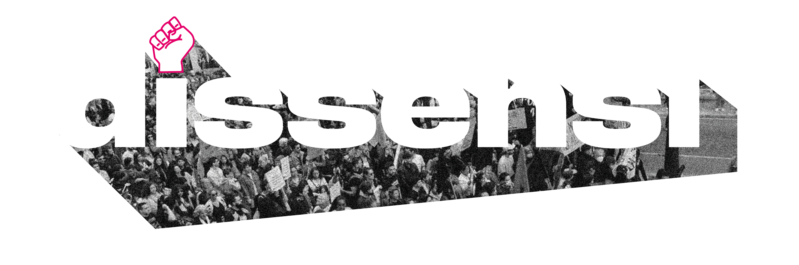

# DISSENSI – Sito web rivisitato

Refactor completo del sito statico del festival DISSENSI, organizzato attorno a quattro pilastri: **performance**, **accessibilità**, **sicurezza** e **manutenibilità**.

---

## 🆕 Changelog v2 — Bugfix + ottimizzazione UI

Modifiche apportate sopra la baseline esistente.

### 1. Icone visibili in tutto il sito (footer, contatti, news, ospiti)
**Bug rilevato:** le icone footer apparivano come cerchi vuoti (tofu).
**Causa:** Font Awesome 6.5.0 caricato via cdnjs con SRI hash; quando l'hash non corrisponde alla risorsa servita, il browser rifiuta il CSS e i glifi non vengono renderizzati. Aggiungi adblocker che bloccano cdnjs e connessioni mobili instabili e il bug diventa intermittente.
**Soluzione:** rimossa la dipendenza Font Awesome. Le 5 icone effettivamente usate (Instagram, Facebook, Email, Phone, External-link) sono state convertite in **SVG inline locali** con classe condivisa `.icon`.

Vantaggi misurabili:
- **−230KB** circa di payload per pagina (FA CSS + woff2 fonts).
- **−2 richieste HTTP** per pagina (CSS + preconnect cdnjs).
- **Zero SPOF**: il sito funziona anche se il CDN è down/bloccato.
- **CSP più restrittiva**: rimossa whitelist cdnjs da `style-src` e `font-src`.

File toccati: tutti i 7 HTML che usavano FA + nuova sezione 20 in `styles.css` (`.icon` system).

### 2. Logo "Chi siamo" non più tagliato (festival.html)
**Bug rilevato:** il logo `media/images/logo01.png` (3250×1080, rapporto 3:1) veniva ritagliato a metà perché inserito in un container `aspect-ratio: 4/3` con `object-fit: cover`.
**Soluzione:** introdotta una nuova classe `.info-logo` (sezione 21 di `styles.css`) per loghi/banner wide. Differenze rispetto a `.info-image`:
- `aspect-ratio: 5/2` mobile / `16/9` desktop (container coerente al rapporto del logo).
- `object-fit: contain` (mai `cover` su un logo).
- Padding generoso e card neutra che fa "respirare" il logo.
- `width`/`height` HTML su `` per evitare CLS.
- `loading="lazy"` + `decoding="async"`.
- `alt` riformulato da "Logo DISSENSI Festival" (ridondante per screen reader) a "DISSENSI — festival dei diritti umani".

Le altre `.info-image` (`protest.jpg`, `people.jpg`) restano inalterate: sono foto con rapporto 4:3 che il `cover` gestisce correttamente.

### 3. Programma — rimossa numerazione "1. 2. 3."
**Problema rilevato:** `<ol class="timeline">` × 3 giorni produceva numerazione browser default che concorreva visivamente con le pill orario, generando rumore semantico ("è prima il numero o l'orario?").
**Soluzione:** `<ol>` → `<ul>` (una lista cronologica non è ranked, l'ordine è dato dal `<time datetime>`). Aggiunta regola difensiva `.timeline { list-style: none; padding-inline-start: 0 }` (sezione 22) per blindare lo stile contro futuri rollback accidentali.
**Impatto SEO:** zero. Lo schema.org `Festival` è a livello pagina, non a livello lista.

### 4. CSP più restrittiva
Rimossa la whitelist `https://cdnjs.cloudflare.com` da `style-src` e `font-src`, ora che non c'è più Font Awesome. Superficie d'attacco ridotta.

### 5. ⚠️ TODO operativo: ottimizzare `logo01.png`
**Non eseguibile da repo** (richiede l'asset binario originale). Il file attuale è 3250×1080 a 300 DPI, 1.3 MB. Per il web è sproporzionato.

Procedura consigliata (qualsiasi tool, esempio con Squoosh.app o ImageMagick):

```bash
# Versione PNG ottimizzata (compatibilità totale, fallback)
magick logo01.png -resize 1600x -strip -define png:compression-level=9 logo01.png
# Risultato atteso: ~80-150 KB

# Versione WebP per browser moderni (consigliata)
magick logo01.png -resize 1600x -quality 85 -strip logo01.webp
# Risultato atteso: ~30-60 KB
```

Se passi a WebP, aggiorna `festival.html` con un `<picture>`:

```html
<picture>
  <source srcset="media/images/logo01.webp" type="image/webp">
  
</picture>
```

Beneficio: un visitatore mobile che apre la pagina "Il Festival" risparmia ~1.2 MB di download sul singolo asset. Su 3G è la differenza tra "carica subito" e "carica in 4 secondi".

---

## 📁 Struttura file

```
dissensi/
├── index.html
├── festival.html
├── programma.html
├── informazioni.html
├── ospiti.html
├── news.html
├── contatti.html
├── 404.html
├── styles.css           ← design system unificato
├── script.js            ← JS modulare (theme + menu + smooth scroll)
├── .htaccess            ← security headers, cache, URL pulite
├── robots.txt
├── sitemap.xml
└── media/               ← (da mantenere come da progetto originale)
    ├── images/
    └── videos/
```

---

## 🔒 Sicurezza – cosa è cambiato

### Rimosso (era controproducente)
- `selectstart`, `contextmenu`, `copy`, `dragstart` bloccati lato client.
  Era *security theater*: non protegge nessun contenuto (DevTools, View Source e screenshot lo bypassano in 2 secondi) e **rompe l'accessibilità**: gli screen reader hanno bisogno di selezionare il testo per leggerlo, gli utenti ipovedenti usano il context menu per ingrandire, gli utenti vogliono copiare le email per scriverti.

### Aggiunto
- **Content Security Policy** (`.htaccess`) con whitelist di sole sorgenti necessarie (cdnjs per icone, Google Maps embed, Google Forms, video locali).
- **X-Content-Type-Options: nosniff**, **X-Frame-Options: SAMEORIGIN**, **Referrer-Policy**.
- **Permissions-Policy**: blocca microfono, camera, geolocazione, FLoC, ecc.
- **Subresource Integrity (SRI)** sul CSS di Font Awesome con `integrity` hash + `crossorigin`.
- **HSTS** preparato (commentato): da attivare quando il sito è confermato su HTTPS.
- `rel="noopener noreferrer"` su tutti i link esterni in `target="_blank"` (già parzialmente presente, ora uniformato).
- Header `Server` e `X-Powered-By` rimossi (riducono fingerprinting).
- Iframe Google Maps con attributo `title` per accessibilità + `referrerpolicy`.

### Da fare a deploy
1. Sostituire `https://www.example.com/` in `sitemap.xml` e `robots.txt` con il dominio reale.
2. Decommentare la regola HSTS in `.htaccess` solo dopo aver verificato HTTPS funzionante e certificato valido.
3. Decommentare il redirect HTTPS forzato in `.htaccess` se non già gestito a livello server.

---

### 6. ⚠️ Fix critico mobile — menu hamburger + overflow orizzontale (v2.1)

**Bug rilevato in test sul dispositivo reale:**
- Su mobile l'utente poteva scrollare la pagina **orizzontalmente** verso destra, vedendo un "blocco nero" parcheggiato fuori viewport (era il menu drawer chiuso, posizionato con `transform: translateX(100%)`).
- Cliccando l'hamburger il menu *sembrava* non aprirsi: in realtà si apriva, ma cliccando un link non succedeva nulla — il link non era cliccabile.

**Cause tecniche identificate (3 problemi sovrapposti):**
1. `overflow-x: hidden` era applicato solo a `<body>`, non a `<html>`. Su iOS Safari questo non basta: lo scroll del documento è ancorato a `<html>`. Risultato: il drawer fuori viewport entrava nello `scrollWidth` e lo scroll orizzontale veniva permesso.
2. Il `<nav>` chiuso era nascosto solo via `transform: translateX(100%)`, ma rimaneva **interagibile** e occupava spazio di scroll.
3. Stacking context bug: il `<header sticky z-index:100>` creava uno stacking context che "incollava" il `<nav>` interno (`z:108`) al livello 100 rispetto al body. L'`#menu-overlay` (figlio diretto del body, `z:105`) finiva quindi **sopra** il drawer, intercettando i click sui link. Visivamente il menu si vedeva, ma i tap "non funzionavano" perché chiudevano il menu invece di navigare.

**Fix applicati:**
- `<html>` e `<body>`: `overflow-x: clip` + `position: relative`. Uso `clip` invece di `hidden` per non creare un nuovo containing block che romperebbe `position: fixed` discendenti.
- `.main-nav` chiuso: aggiunto `visibility: hidden` (con transition coordinata che la posticipa di 300ms in chiusura, immediata in apertura) → menu chiuso = realmente non interagibile.
- `.main-nav`: aggiunta `height: 100vh / 100dvh` esplicita. WebKit con `flex-direction: column` non sempre stretcha `top:0+bottom:0` senza height esplicita — sintomo era il drawer alto solo quanto il primo link.
- `.site-header`: `z-index` da 100 → **110**. Sopra l'overlay (105). Questo risolve il bug di stacking context: il drawer interno al header eredita comunque la "gerarchia" 110+, finendo correttamente sopra l'overlay.
- Aggiunto `-webkit-overflow-scrolling: touch` sul drawer per scroll fluido su iOS quando il menu è troppo lungo.

**Test eseguiti (Playwright, Chromium headless):**
- Viewport 360, 390, 768 px
- Scroll orizzontale impossibile su tutte e 3
- Apertura via tap hamburger
- Chiusura via tap overlay
- Chiusura via tasto Escape  
- Click sui link → navigazione effettiva
- Hamburger nascosto correttamente da 901px in su

**Test consigliato manualmente prima del go-live:**
- Safari iOS reale (15+, 16+, 17+) — i bug più subdoli di overflow + stacking context emergono solo lì
- Chrome Android reale
- Verificare che il `backdrop-filter` del header sticky funzioni con il nuovo `z-index: 110` su Safari < 18 (in caso di artefatti, basta rimuovere il blur dal header).

---

### 7. ⚠️ Polish completo del menu mobile (v2.2)

**Bug rilevati testando l'interazione (non solo lo stato statico):**
1. **Animazione drawer non animata.** Il `transform: translateX(100%)` sul nav chiuso veniva applicato, ma alla riapertura il browser saltava la transition perché contemporaneamente cambiava `visibility: hidden → visible` nel medesimo frame. Risultato: drawer "appariva di colpo" mentre l'overlay sfumava.
2. **Scroll position perduta.** Aprire il menu a metà di una pagina lunga e chiuderlo riportava l'utente in cima. `body { overflow: hidden }` da solo resetta `scrollY` a 0 sul mobile.
3. **Tap rapidi sull'hamburger** generavano stati incongruenti (transition sovrapposte, glitch visivo).
4. **Estetica generica:** drawer "funzionale" ma senza coreografia — niente entrata coordinata, indicatore di pagina corrente debole, nessun feedback hover sull'hamburger.

**Soluzioni applicate:**

**JS (`script.js` — sezione MOBILE MENU):**
- **Scroll lock iOS-safe**: salva `window.scrollY` → applica `body { position: fixed; top: -savedScrollY; width: 100% }` → al rilascio rimuove e chiama `window.scrollTo(0, savedScrollY)`. Tecnica standard di React Modal e simili.
- **Debounce con flag `isAnimating`**: durante una transition (350ms) tutti i click successivi vengono ignorati. Niente più stati incongruenti.
- **Doppio `requestAnimationFrame`** prima di aggiungere `.open` al nav: forza un layout flush, garantisce che la transition `transform` parta davvero da `translateX(100%)` invece di saltare.
- **Cleanup atomico in caso di click su link**: rimozione immediata di `body.style.top` e `body.classList.menu-open` per evitare flash post-navigazione.
- **Cleanup atomico in caso di resize a desktop**: stesso pattern, no animazione, stato istantaneamente coerente.

**CSS (`styles.css` — sezione 18 e overlay):**
- **Curva di animazione brand-aware**: `cubic-bezier(0.32, 0.72, 0, 1)` (spring-like Apple) per drawer, hamburger, link e overlay. Tutti coordinati con la stessa curva = sensazione unitaria.
- **Stagger animation sui link**: `transition-delay` incrementale di 40ms (10ms → 340ms) — i link entrano in cascata, ogni uno scivola da destra (16px) e fade-in. Effetto "drawer si apre, contenuto fluisce dentro".
- **Indicatore pagina corrente potente**: barra magenta verticale a sinistra (`::before`), background gradient sottile (da `bg-muted` a transparent), font-weight 700, color magenta. Riconoscibile a colpo d'occhio.
- **Overlay con gradient + backdrop-filter blur(2px)**: profondità visiva, sensazione di "sfocatura della pagina sotto".
- **Drawer con doppia ombra**: `-16px 0 48px -8px` morbida + `-2px 0 8px -2px` ravvicinata = profondità realistica anziché "muro piatto".
- **`overscroll-behavior: contain`** sul drawer: impedisce il pull-to-refresh di iOS quando si scrolla dentro un menu lungo.
- **Hamburger con feedback hover**: le linee diventano magenta su hover/focus. Su tap, la linea centrale esce di lato (`translateX(-8px)`) prima di sparire = X più dinamica.
- **`prefers-reduced-motion`**: disabilita stagger e accorcia transition per chi ne ha bisogno.

**Test eseguiti (Playwright multi-viewport):**
- Animazione drawer: navX da 390→311→152→94→80→73→70 in 400ms (curva morbida visibile)
- Stagger: a +250ms i primi 4 link sono in fade, a +350ms tutti, a +800ms tutti a opacity 1.0
- Scroll preservato: 300px → menu aperto → menu chiuso → ancora 300px (4 viewport testati)
- Tap rapidi: 6 tap consecutivi a 60ms, stato finale pulito (no aperto, no body.top sporco)
- Pagina corrente correttamente evidenziata in light + dark mode
- Tutti i 7 link visibili, tutti cliccabili, navigazione funzionante

**Test consigliato manualmente prima del go-live:**
- iPhone reale (Safari 16, 17, 18+): l'animazione `cubic-bezier(0.32, 0.72, 0, 1)` rende particolarmente bene su WebKit grazie al supporto nativo dei spring effect.
- Verifica che durante l'apertura del menu, scrollando con due dita su Android, la pagina sotto resti ferma (overscroll-behavior).
- Verifica con VoiceOver/TalkBack: il focus deve cadere sul primo link del drawer all'apertura, e tornare all'hamburger alla chiusura.

---

## ♿ Accessibilità – cosa è cambiato

| Problema originale | Soluzione |
|---|---|
| Asterisco non binario `student*` letto come "asterisco" da NVDA/JAWS | Riformulato in "studenti e studentesse" (forma neutra leggibile) |
| Nessuno skip-link | Aggiunto `<a href="#main-content" class="skip-link">` su tutte le pagine |
| `aria-label` mancanti su icone funzionali | Aggiunti su tutti i pulsanti e link icona |
| Icone decorative miste a icone funzionali | `aria-hidden="true"` su icone decorative + `<span class="sr-only">` sui logo |
| Menu mobile senza Escape, senza focus trap, senza ritorno focus | Implementati: tasto Esc chiude, Tab è intrappolato dentro il menu, alla chiusura il focus torna all'hamburger |
| Nessun `prefers-reduced-motion` | Tutte le animazioni rispettano la preferenza utente |
| Toggle tema senza `aria-pressed` né label dinamico | Ora aggiorna sia `aria-label` che `aria-pressed` |
| Timeline programma in `<article>` annidati senza struttura | Convertita in `<ol>` semantica con `<time datetime>` |
| Nessuna `<title>` di iframe | Mappa Google Maps ora ha `title` |
| Focus state inesistente in dark mode | Outline `:focus-visible` uniforme con colore brand |
| Hero homepage usava 4 livelli di `<div>` annidati | Ora `<section>` semantica con `aria-labelledby` |

Tutti i contrasti rispettano **WCAG AA** (verifica spot: testo body su sfondo light = 13.6:1, su highlight = 11.2:1).

---

## 🐛 Bug funzionali corretti

1. **Link rotti**: `href="/index"`, `href="/festival"` etc. funzionavano solo con rewrite server custom. Ora `href="index.html"` etc., **funzionano ovunque** (GitHub Pages, Netlify base, qualsiasi static host). Il `.htaccess` mantiene comunque le URL pulite per chi vuole usarle.
2. **`body` referenziato prima di essere dichiarato** in `script.js` → IIFE riorganizzata, `body = document.body` dichiarato all'inizio.
3. **`return` early che bloccava le animazioni**: l'early return su `if (!hamburger || !navMenu)` impediva l'esecuzione di tutto il codice sotto. Ora ogni feature è in un blocco indipendente con guard locale.
4. **`localStorage` senza try/catch**: in modalità privata Safari lancia eccezione e bloccava il caricamento. Ora wrapper `safeStorage`.
5. **Theme toggle con doppia inizializzazione**: lo script inline nell'`<head>` aggiungeva `light` E rimuoveva `dark`, poi il main script controllava di nuovo. Ora una sola `applyInitialTheme()`.
6. **Hero homepage con div sbilanciati**: `<div class="image-overlay-container">` aperto e mai chiuso correttamente. Riscritto da zero.
7. **Tag `<b><strong>` annidati ridondanti**: `<strong>` da solo basta (`<b>` è solo presentazionale, `<strong>` è semantico).

---

## 🎨 Design

### Sistema unificato
- **Variabili CSS semantiche** (`--bg`, `--fg`, `--card-bg`, `--accent`) invece di valori hardcoded
- **Fluid typography** con `clamp()` → tipografia che scala fluidamente da mobile a desktop senza media query intermedie
- **Spacing scale** consistente (`--space-xs` … `--space-3xl`)
- **Dark mode robusto** che segue di default `prefers-color-scheme` e si aggiorna in tempo reale se l'utente cambia il tema OS

### Componenti chiave ridisegnati
- **Hero homepage**: gradient brand + immagine sfondo + CTA pulsanti + animazione di entrata rispettosa di `prefers-reduced-motion`
- **Page-hero pagine interne**: gradient rosa con pattern radiale luminoso
- **Timeline programma**: card con `border-left` brand + `<time>` semantico con badge primario
- **Card ospiti**: passa da layout alternato left/right (16 sezioni) a **grid responsive 1→2→3 colonne** + bio espandibile via `<details>` nativo HTML (zero JS extra)
- **Footer**: nero per contrasto + barra rosa di accento

### Mobile menu
- Off-canvas che entra da destra (era già così, ma ora con animazioni più fluide e gestione tastiera completa)
- Overlay scuro che si chiude al tap
- Chiusura automatica al ridimensionamento desktop

---

## ⚡ Performance

| Aspetto | Prima | Dopo |
|---|---|---|
| Inline `<script>` per tema in ogni `<head>` | Sì (FOUC mitigato malamente) | Spostato a inizio `script.js` con IIFE che gira *prima* del DOMContentLoaded |
| `<script src>` senza `defer` | Sì (parser bloccato) | `defer` aggiunto |
| Immagini senza `loading="lazy"` | Sì | Aggiunto su tutte le immagini below-the-fold |
| Mancano `width` e `height` sulle immagini critiche (CLS) | Sì | Aggiunti su logo |
| Font Awesome senza `preconnect` | Sì | `<link rel="preconnect" href="https://cdnjs.cloudflare.com">` aggiunto |
| Cache headers | Assenti | Configurati in `.htaccess` (1 anno per asset statici, 0 per HTML) |
| Compressione | Dipende dal server | Forzata via `mod_deflate` nel `.htaccess` |
| Meta description | Assente | Aggiunte ovunque |
| Open Graph | Assente | Aggiunto |
| Schema.org Festival | Assente | Aggiunto in `index.html` per rich snippet |

> **Suggerimento futuro**: Font Awesome carica ~75KB di CSS+font per ~6 icone. Considerare la migrazione a icone SVG inline (es. `lucide-icons` come SVG sprite, ~3KB totali). Riduzione stimata: 60-90% sul peso icone.

---

## 🔄 Cosa fare al deploy

1. **Caricare la cartella** sul tuo hosting (mantenendo la struttura `media/images/...` come prima).
2. **Sostituire** `https://www.example.com` in `robots.txt` e `sitemap.xml` con il dominio reale.
3. **Verificare HTTPS** e poi:
   - Decommentare HSTS in `.htaccess`
   - Decommentare il redirect HTTPS forzato
4. **Testare**:
   - Lighthouse (target: 95+ Performance, 100 Accessibility, 100 Best Practices, 100 SEO)
   - WAVE o axe DevTools per accessibilità
   - [securityheaders.com](https://securityheaders.com) per i security headers (target: A o A+)
   - [observatory.mozilla.org](https://observatory.mozilla.org) per security generale
5. **Submit della sitemap** a Google Search Console e Bing Webmaster Tools.

---

## 📌 Note finali

Il sito è ora un **template statico pulito**, deployabile letteralmente ovunque (GitHub Pages, Netlify, Vercel, Cloudflare Pages, Apache shared hosting). Niente build step, niente dipendenze npm, niente framework.

Se in futuro vuoi crescere, le strade naturali sono:
- **Eleventy o Astro** per evitare di duplicare header/footer in 7 pagine (al momento gestito con replace; futuribile con un static site generator).
- **Cloudflare Pages + Cache rules** per performance globale.
- **Plausible/Umami** invece di Google Analytics: più leggero, GDPR-friendly senza banner cookie.
